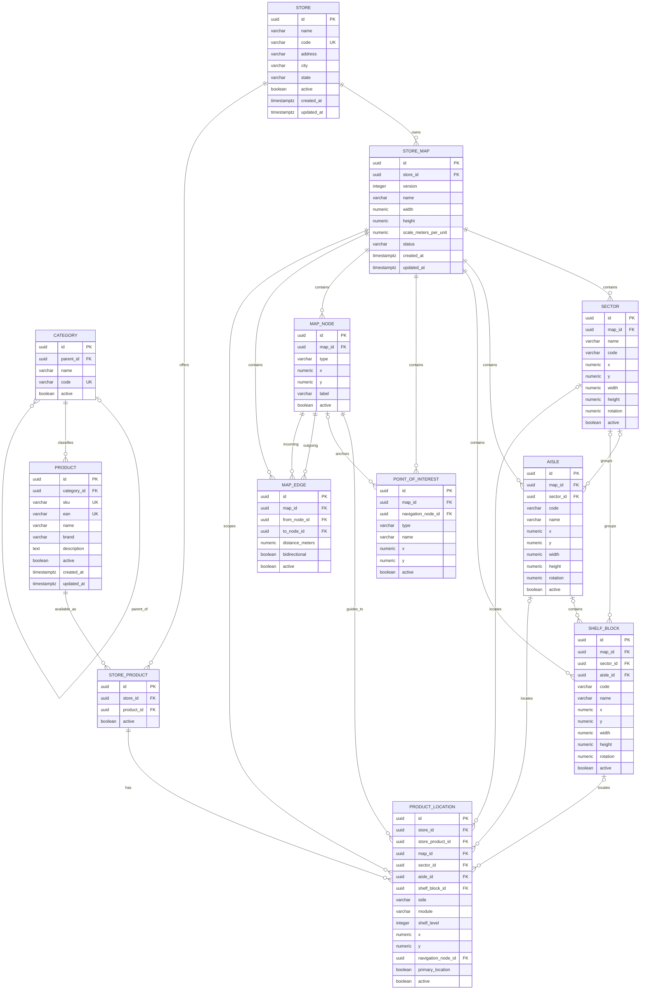

# Modelo de Dados — Indoor Supermarket Navigator

## 1. Objetivo e limites

Este documento consolida a modelagem relacional do PostgreSQL para o MVP do
Indoor Supermarket Navigator.

O PostgreSQL é a fonte persistente oficial. Redis não participa da modelagem
de integridade e, quando utilizado, deverá servir apenas para cache ou dados
efêmeros.

Este documento não cria entidades JPA, repositories, services, controllers,
migrations ou algoritmo de rotas.

As tabelas persistem apenas:

- lojas;
- versões dos mapas;
- setores, corredores e blocos/prateleiras;
- categorias e produtos;
- disponibilidade do produto por loja;
- localizações de produtos;
- pontos de interesse;
- nós e conexões do grafo de navegação.

Listas de compras podem permanecer no frontend no MVP. Rotas, paradas e
histórico de rotas também não são persistidos nesta etapa.

## 2. Convenções relacionais

- Nomes físicos de tabelas e colunas usam `snake_case`.
- Todas as chaves primárias são `UUID`.
- Datas de criação e atualização usam `TIMESTAMPTZ`.
- Medidas geométricas usam `NUMERIC`; a unidade das coordenadas é a unidade
  local do mapa, convertida por `scale_meters_per_unit`.
- Estados e tipos enumerados são armazenados como `VARCHAR` com `CHECK`, em vez
  de tipos nativos do PostgreSQL. Isso mantém os valores explícitos sem
  acoplar a evolução do modelo a alterações de tipos nativos.
- Campos `active` são `BOOLEAN NOT NULL` e representam ativação lógica. O
  modelo não adiciona `deleted_at`, pois isso não foi definido no escopo.
- Valores padrão sugeridos para flags são `TRUE` para novos registros
  estruturais e `FALSE` para `product_location.primary_location`. O fluxo de
  criação ainda deverá definir `created_at` e `updated_at`.

As precisões exatas de `NUMERIC`, limites máximos de textos e convenções de
coordenadas não foram definidos no PRD. As precisões indicadas abaixo são
recomendações físicas iniciais, não regras de negócio.

## 3. Diagrama ER



O diagrama mostra os relacionamentos conceituais. As FKs compostas e as
restrições de consistência entre mapas estão detalhadas nas seções de cada
entidade.

## 4. Entidades e atributos

### 4.1 `store`

Representa uma unidade física do supermercado.

| Coluna | Tipo | Nulo | Chave/ regra |
|---|---|---:|---|
| `id` | `UUID` | não | PK |
| `name` | `VARCHAR` | não | Nome da loja |
| `code` | `VARCHAR` | não | `UNIQUE` |
| `address` | `VARCHAR` | não | Endereço conforme o escopo |
| `city` | `VARCHAR` | não | Cidade |
| `state` | `VARCHAR` | não | Estado; formato específico não definido |
| `active` | `BOOLEAN` | não | Ativação lógica; default recomendado `TRUE` |
| `created_at` | `TIMESTAMPTZ` | não | Auditoria de criação |
| `updated_at` | `TIMESTAMPTZ` | não | Auditoria de atualização |

Cardinalidades:

- uma `store` possui zero ou muitas `store_map`;
- uma `store` possui zero ou muitas `store_product`.

`code` é tratado como identificador técnico global da unidade. Se o negócio
permitir códigos repetidos entre redes ou contextos futuros, essa regra deverá
ser revista antes da migration.

### 4.2 `store_map`

Representa uma versão do mapa de uma loja.

| Coluna | Tipo | Nulo | Chave/ regra |
|---|---|---:|---|
| `id` | `UUID` | não | PK |
| `store_id` | `UUID` | não | FK para `store(id)` |
| `version` | `INTEGER` | não | `CHECK (version > 0)`; única por loja |
| `name` | `VARCHAR` | não | Nome legível da versão |
| `width` | `NUMERIC(12,4)` | não | `CHECK (width > 0)` |
| `height` | `NUMERIC(12,4)` | não | `CHECK (height > 0)` |
| `scale_meters_per_unit` | `NUMERIC(12,6)` | não | `CHECK (scale_meters_per_unit > 0)` |
| `status` | `VARCHAR(20)` | não | `DRAFT`, `ACTIVE` ou `ARCHIVED` |
| `created_at` | `TIMESTAMPTZ` | não | Auditoria de criação |
| `updated_at` | `TIMESTAMPTZ` | não | Auditoria de atualização |

Restrições:

- `UNIQUE (store_id, version)`;
- `UNIQUE (store_id, id)`, chave técnica para FKs compostas;
- `CHECK (status IN ('DRAFT', 'ACTIVE', 'ARCHIVED'))`;
- índice único parcial para permitir no máximo um mapa ativo por loja:

```sql
CREATE UNIQUE INDEX ux_store_map_one_active_per_store
    ON store_map (store_id)
    WHERE status = 'ACTIVE';
```

O banco garante zero ou um mapa `ACTIVE` por loja, mas não exige que toda loja
tenha um mapa ativo. A exigência de pelo menos um mapa publicado é uma regra de
operação e permanece `UNRESOLVED`.

### 4.3 `sector`

Representa uma área lógica desenhada em um mapa.

| Coluna | Tipo | Nulo | Chave/ regra |
|---|---|---:|---|
| `id` | `UUID` | não | PK |
| `map_id` | `UUID` | não | FK para `store_map(id)` |
| `name` | `VARCHAR` | não | Nome do setor |
| `code` | `VARCHAR` | não | Único dentro do mapa |
| `x`, `y` | `NUMERIC(12,4)` | não | Coordenadas do desenho |
| `width`, `height` | `NUMERIC(12,4)` | não | `CHECK` recomendado: valores `> 0` |
| `rotation` | `NUMERIC(12,4)` | não | Unidade angular ainda não definida |
| `active` | `BOOLEAN` | não | Ativação lógica; default recomendado `TRUE` |

Restrições e cardinalidades:

- `UNIQUE (map_id, code)`;
- `UNIQUE (map_id, id)`, chave técnica para FKs compostas;
- `map_id` deve apontar para o mapa que contém o setor;
- um setor pode estar associado a zero ou muitos corredores, blocos/prateleiras
  e localizações de produto.

### 4.4 `aisle`

Representa um corredor físico.

| Coluna | Tipo | Nulo | Chave/ regra |
|---|---|---:|---|
| `id` | `UUID` | não | PK |
| `map_id` | `UUID` | não | FK para `store_map(id)` |
| `sector_id` | `UUID` | sim | Setor opcional do mesmo mapa |
| `code` | `VARCHAR` | não | Único dentro do mapa |
| `name` | `VARCHAR` | não | Nome do corredor |
| `x`, `y` | `NUMERIC(12,4)` | não | Coordenadas do desenho |
| `width`, `height` | `NUMERIC(12,4)` | não | `CHECK` recomendado: valores `> 0` |
| `rotation` | `NUMERIC(12,4)` | não | Unidade angular ainda não definida |
| `active` | `BOOLEAN` | não | Ativação lógica; default recomendado `TRUE` |

Restrições:

- `UNIQUE (map_id, code)`;
- `UNIQUE (map_id, id)`;
- FK composta `(map_id, sector_id)` para `(sector.map_id, sector.id)` quando
  `sector_id` estiver preenchido;
- `UNIQUE (map_id, id, sector_id)` para permitir validar, quando informados,
  setor e corredor como uma combinação coerente.

Um corredor pode não estar associado a um setor. Se estiver associado, o
`sector_id` não pode apontar para um setor de outro mapa.

### 4.5 `shelf_block`

Representa um bloco ou prateleira desenhado no mapa.

| Coluna | Tipo | Nulo | Chave/ regra |
|---|---|---:|---|
| `id` | `UUID` | não | PK |
| `map_id` | `UUID` | não | FK para `store_map(id)` |
| `sector_id` | `UUID` | sim | Setor opcional do mesmo mapa |
| `aisle_id` | `UUID` | sim | Corredor opcional do mesmo mapa |
| `code` | `VARCHAR` | não | Único dentro do mapa |
| `name` | `VARCHAR` | sim | Nome opcional |
| `x`, `y` | `NUMERIC(12,4)` | não | Coordenadas do desenho |
| `width`, `height` | `NUMERIC(12,4)` | não | `CHECK` recomendado: valores `> 0` |
| `rotation` | `NUMERIC(12,4)` | não | Unidade angular ainda não definida |
| `active` | `BOOLEAN` | não | Ativação lógica; default recomendado `TRUE` |

Restrições:

- `UNIQUE (map_id, code)`;
- `UNIQUE (map_id, id)`;
- FKs compostas `(map_id, sector_id)` e `(map_id, aisle_id)` para impedir
  referências a outro mapa;
- quando os três valores forem preenchidos, a combinação
  `(map_id, aisle_id, sector_id)` deve existir no corredor correspondente.

Os vínculos entre setor, corredor e bloco permanecem opcionais conforme o
escopo. A ausência de um vínculo não é substituída por inferência geométrica.

### 4.6 `category`

Representa uma categoria hierárquica de produtos.

| Coluna | Tipo | Nulo | Chave/ regra |
|---|---|---:|---|
| `id` | `UUID` | não | PK |
| `parent_id` | `UUID` | sim | FK para `category(id)` |
| `name` | `VARCHAR` | não | Nome da categoria |
| `code` | `VARCHAR` | não | `UNIQUE` |
| `active` | `BOOLEAN` | não | Ativação lógica; default recomendado `TRUE` |

Restrições e cardinalidades:

- uma categoria pode ter zero ou muitas subcategorias;
- uma categoria pode classificar zero ou muitos produtos;
- `CHECK (parent_id IS NULL OR parent_id <> id)` impede autorreferência direta;
- ciclos com mais de dois níveis exigem validação transacional na aplicação,
  pois não são impedidos por um `CHECK` simples;
- `parent_id` deve ser removido ou alterado antes da exclusão de uma categoria
  que possua dependentes. A política recomendada é `ON DELETE RESTRICT`.

O nível máximo da hierarquia não foi definido.

### 4.7 `product`

Representa um produto global do catálogo.

| Coluna | Tipo | Nulo | Chave/ regra |
|---|---|---:|---|
| `id` | `UUID` | não | PK |
| `category_id` | `UUID` | não | FK para `category(id)` |
| `sku` | `VARCHAR` | não | `UNIQUE` no catálogo global |
| `ean` | `VARCHAR` | sim | Único quando informado |
| `name` | `VARCHAR` | não | Nome do produto |
| `brand` | `VARCHAR` | sim | Marca opcional |
| `description` | `TEXT` | sim | Descrição opcional |
| `active` | `BOOLEAN` | não | Ativação lógica; default recomendado `TRUE` |
| `created_at` | `TIMESTAMPTZ` | não | Auditoria de criação |
| `updated_at` | `TIMESTAMPTZ` | não | Auditoria de atualização |

Restrições:

- `category_id` não pode ser nulo;
- `sku` é tratado como identificador global do catálogo;
- `ean`, quando informado, deve ser único por meio de índice único parcial:

```sql
CREATE UNIQUE INDEX ux_product_ean_not_null
    ON product (ean)
    WHERE ean IS NOT NULL;
```

A validade, quantidade de dígitos e padrão de cada EAN não foram definidos e
permanecem `UNRESOLVED`.

### 4.8 `store_product`

Relaciona um produto global à loja em que ele está disponível.

| Coluna | Tipo | Nulo | Chave/ regra |
|---|---|---:|---|
| `id` | `UUID` | não | PK |
| `store_id` | `UUID` | não | FK para `store(id)` |
| `product_id` | `UUID` | não | FK para `product(id)` |
| `active` | `BOOLEAN` | não | Disponibilidade lógica; default recomendado `TRUE` |

Restrições e cardinalidades:

- `UNIQUE (store_id, product_id)`;
- `UNIQUE (store_id, id)`, chave técnica para FKs compostas;
- uma loja possui zero ou muitos produtos;
- um produto pode estar disponível em zero ou muitas lojas;
- não há preço, estoque, promoção ou quantidade persistidos no MVP.

### 4.9 `product_location`

Representa uma localização de um produto em uma loja e em uma versão de mapa.
Um mesmo produto pode possuir várias localizações, como uma posição principal
e uma ilha promocional.

| Coluna | Tipo | Nulo | Chave/ regra |
|---|---|---:|---|
| `id` | `UUID` | não | PK |
| `store_id` | `UUID` | não | Campo técnico para consistência composta |
| `store_product_id` | `UUID` | não | FK composta com `store_id` |
| `map_id` | `UUID` | não | FK composta com `store_id` |
| `sector_id` | `UUID` | sim | Setor opcional do mesmo mapa |
| `aisle_id` | `UUID` | sim | Corredor opcional do mesmo mapa |
| `shelf_block_id` | `UUID` | sim | Bloco/prateleira opcional do mesmo mapa |
| `side` | `VARCHAR(10)` | sim | `LEFT`, `RIGHT` ou `CENTER` |
| `module` | `VARCHAR` | sim | Módulo opcional |
| `shelf_level` | `INTEGER` | sim | Nível opcional; faixa não definida |
| `x` | `NUMERIC(12,4)` | sim | Coordenada opcional |
| `y` | `NUMERIC(12,4)` | sim | Coordenada opcional |
| `navigation_node_id` | `UUID` | não | Nó do mesmo mapa |
| `primary_location` | `BOOLEAN` | não | Default recomendado `FALSE` |
| `active` | `BOOLEAN` | não | Ativação lógica; default recomendado `TRUE` |

Restrições:

- `CHECK (side IS NULL OR side IN ('LEFT', 'RIGHT', 'CENTER'))`;
- `CHECK (NOT primary_location OR active)`;
- FK composta `(store_id, store_product_id)` para
  `(store_product.store_id, store_product.id)`;
- FK composta `(store_id, map_id)` para
  `(store_map.store_id, store_map.id)`;
- FKs compostas `(map_id, sector_id)`, `(map_id, aisle_id)` e
  `(map_id, shelf_block_id)` para os elementos do mesmo mapa;
- FK composta `(map_id, navigation_node_id)` para
  `(map_node.map_id, map_node.id)`;
- quando `shelf_block_id`, `aisle_id` e `sector_id` forem simultaneamente
  informados, a combinação deve ser compatível com a hierarquia do
  `shelf_block`;
- índice único parcial para no máximo uma localização principal por produto,
  loja e versão de mapa:

```sql
CREATE UNIQUE INDEX ux_product_location_one_primary
    ON product_location (store_product_id, map_id)
    WHERE primary_location = TRUE;
```

O `store_id` é deliberadamente repetido nesta tabela. Ele não é uma segunda
fonte de verdade: deve ser preenchido com o mesmo valor das linhas referidas
por `store_product_id` e `map_id`, e as FKs compostas impedem divergências.
Sem esse componente, duas FKs independentes permitiriam combinar um produto de
uma loja com um mapa de outra.

O modelo permite localizações em mapas `DRAFT` e `ARCHIVED`; o fato de somente
um mapa ser `ACTIVE` não impede a preparação de versões futuras nem a consulta
de versões antigas.

### 4.10 `point_of_interest`

Representa um ponto relevante da loja.

| Coluna | Tipo | Nulo | Chave/ regra |
|---|---|---:|---|
| `id` | `UUID` | não | PK |
| `map_id` | `UUID` | não | FK para `store_map(id)` |
| `navigation_node_id` | `UUID` | sim | Nó opcional do mesmo mapa |
| `type` | `VARCHAR(30)` | não | Tipo enumerado |
| `name` | `VARCHAR` | não | Nome exibido |
| `x` | `NUMERIC(12,4)` | não | Coordenada do ponto |
| `y` | `NUMERIC(12,4)` | não | Coordenada do ponto |
| `active` | `BOOLEAN` | não | Ativação lógica; default recomendado `TRUE` |

Tipos permitidos:

```text
ENTRANCE
EXIT
CHECKOUT
CART
RESTROOM
CUSTOMER_SERVICE
PARKING
ELEVATOR
STAIRS
OTHER
```

Restrições:

- `CHECK` para restringir `type` aos valores acima;
- FK composta `(map_id, navigation_node_id)` quando o nó for informado;
- um ponto de interesse pertence a exatamente um mapa;
- o nó pode ser compartilhado por zero ou vários pontos de interesse, pois o
  escopo não exige unicidade de ancoragem.

### 4.11 `map_node`

Representa um ponto navegável do grafo associado a um mapa.

| Coluna | Tipo | Nulo | Chave/ regra |
|---|---|---:|---|
| `id` | `UUID` | não | PK |
| `map_id` | `UUID` | não | FK para `store_map(id)` |
| `type` | `VARCHAR(30)` | não | Tipo enumerado |
| `x` | `NUMERIC(12,4)` | não | Coordenada |
| `y` | `NUMERIC(12,4)` | não | Coordenada |
| `label` | `VARCHAR` | sim | Rótulo opcional |
| `active` | `BOOLEAN` | não | Ativação lógica; default recomendado `TRUE` |

Tipos sugeridos pelo escopo:

```text
PATH
INTERSECTION
ENTRANCE
EXIT
PRODUCT_ACCESS
CHECKOUT
```

Restrições:

- `CHECK` para restringir `type` aos valores acima;
- `UNIQUE (map_id, id)`, chave técnica para FKs compostas;
- um mapa possui zero ou muitos nós;
- a existência de um nó `ENTRANCE` ou `CHECKOUT` não é imposta pelo banco.

### 4.12 `map_edge`

Representa uma conexão navegável entre dois nós do mesmo mapa.

| Coluna | Tipo | Nulo | Chave/ regra |
|---|---|---:|---|
| `id` | `UUID` | não | PK |
| `map_id` | `UUID` | não | FK para `store_map(id)` |
| `from_node_id` | `UUID` | não | Nó de origem do mesmo mapa |
| `to_node_id` | `UUID` | não | Nó de destino do mesmo mapa |
| `distance_meters` | `NUMERIC(12,4)` | não | `CHECK (distance_meters > 0)` |
| `bidirectional` | `BOOLEAN` | não | Indica conexão nos dois sentidos |
| `active` | `BOOLEAN` | não | Ativação lógica; default recomendado `TRUE` |

Restrições:

- FKs compostas `(map_id, from_node_id)` e `(map_id, to_node_id)` para
  `map_node(map_id, id)`;
- `CHECK (from_node_id <> to_node_id)`;
- `UNIQUE (map_id, from_node_id, to_node_id)` para não duplicar a mesma aresta
  orientada;
- um mapa possui zero ou muitas arestas;
- um nó pode participar de zero ou muitas arestas como origem e como destino;
- `bidirectional = TRUE` evita exigir duas linhas para a representação
  conceitual de uma conexão nos dois sentidos. A interpretação dessa flag pelo
  algoritmo de rota será definida no módulo de routing.

As FKs para os nós impedem que uma aresta ligue nós de mapas diferentes. O
banco não exige que o grafo seja conexo, que exista caminho entre entrada e
caixas ou que todos os nós ativos tenham arestas; essas são validações de
configuração do mapa e permanecem fora da integridade relacional básica.

## 5. FKs, nulabilidade e comportamento de exclusão

### 5.1 Política recomendada

O MVP não define uma operação de exclusão física para administradores. A
ativação lógica deve ser preferida para registros que já foram usados. Quando
uma exclusão física for necessária, a política recomendada é:

- `store` → `store_map` e `store_product`: `ON DELETE CASCADE`, pois são dados
  dependentes da unidade física;
- `store_map` → setores, corredores, blocos, pontos de interesse, nós, arestas
  e localizações: `ON DELETE CASCADE`, pois são componentes pertencentes à
  versão do mapa;
- `store_product` → `product_location`: `ON DELETE CASCADE`, pois a localização
  não existe sem a associação produto-loja;
- `product` → `store_product`, `category` → `product` e
  `category.parent_id`: `ON DELETE RESTRICT`, evitando perda silenciosa de
  catálogo ou quebra da hierarquia;
- referências de `product_location` a setor, corredor, bloco e nó:
  `ON DELETE RESTRICT`, exigindo remapeamento antes de excluir um elemento que
  ainda localiza produtos;
- `map_edge` → `map_node`: `ON DELETE CASCADE` para remover arestas incidentes
  ao excluir um nó, desde que não existam localizações ou pontos de interesse
  que ainda dependam dele;
- demais referências sem regra explícita: `ON DELETE RESTRICT`.

O uso real dessas políticas deverá ser confirmado quando as operações
administrativas e as migrations forem especificadas.

### 5.2 Nulabilidade

Os campos são opcionais somente quando o requisito explicitamente permite:

- associações de `sector_id` em corredor, bloco e localização;
- associação de `aisle_id` em bloco e localização;
- associação de `shelf_block_id` em localização;
- `PointOfInterest.navigation_node_id`;
- campos descritivos opcionais (`brand`, `description`, `label`, `name` de
  `shelf_block`);
- `ean`, `side`, `module`, `shelf_level`, `x` e `y` de `product_location`.

Uma localização possui `navigation_node_id` obrigatório, mesmo quando seus
campos descritivos de setor/corredor/prateleira não estão preenchidos, porque
o grafo é a referência necessária para navegação.

## 6. Índices recomendados

As PKs e constraints `UNIQUE` já criam índices próprios. Além deles, são
recomendados:

```sql
-- Seleção e listagem de lojas ativas.
CREATE INDEX ix_store_active_name
    ON store (active, name);

-- Busca de mapas por loja e carregamento de estruturas.
CREATE INDEX ix_store_map_store_status
    ON store_map (store_id, status);

CREATE INDEX ix_sector_map_active
    ON sector (map_id, active);

CREATE INDEX ix_aisle_map_active
    ON aisle (map_id, active);

CREATE INDEX ix_shelf_block_map_active
    ON shelf_block (map_id, active);

-- Hierarquia e busca de catálogo.
CREATE INDEX ix_category_parent_active
    ON category (parent_id, active);

CREATE INDEX ix_product_category_active
    ON product (category_id, active);

CREATE INDEX ix_product_name_lower
    ON product (lower(name));

CREATE INDEX ix_store_product_store_active
    ON store_product (store_id, active, product_id);

-- Localizações no mapa e associação ao produto.
CREATE INDEX ix_product_location_store_map_active
    ON product_location (store_id, map_id, active);

CREATE INDEX ix_product_location_store_product_active
    ON product_location (store_product_id, active);

CREATE INDEX ix_product_location_map_node
    ON product_location (map_id, navigation_node_id);

-- Pontos e grafo.
CREATE INDEX ix_poi_map_active_type
    ON point_of_interest (map_id, active, type);

CREATE INDEX ix_map_node_map_active_type
    ON map_node (map_id, active, type);

CREATE INDEX ix_map_edge_map_from_active
    ON map_edge (map_id, from_node_id, active);

CREATE INDEX ix_map_edge_map_to_active
    ON map_edge (map_id, to_node_id, active);
```

O índice `lower(product.name)` atende buscas de igualdade e prefixo simples.
Busca textual avançada, trigramas e extensões do PostgreSQL não são requisitos
definidos e não são adicionados nesta etapa.

## 7. Regras de integridade consolidadas

1. Uma versão de mapa pertence a uma única loja e sua versão é única dentro da
   loja.
2. No máximo uma versão de mapa por loja pode ter status `ACTIVE`.
3. Um setor, corredor, bloco, ponto de interesse, nó ou aresta só pode
   pertencer a um mapa.
4. FKs compostas `(map_id, elemento_id)` impedem que um elemento de um mapa
   seja referenciado por outro mapa.
5. `MapEdge` só pode conectar dois nós do próprio `map_id`.
6. `ProductLocation` só pode associar um `StoreProduct` e um `StoreMap` da
   mesma loja, por meio de `(store_id, store_product_id)` e
   `(store_id, map_id)`.
7. Os vínculos opcionais de setor, corredor e bloco em `ProductLocation` devem
   apontar para elementos do mapa da própria localização.
8. Um produto pode existir em várias lojas, mas só uma vez por loja em
   `StoreProduct`.
9. Um produto pode possuir várias localizações; existe no máximo uma
   localização principal por produto, loja e versão de mapa.
10. Uma aresta não conecta um nó a ele mesmo e não duplica o mesmo par
    orientado dentro do mapa.
11. Desativação lógica não remove registros nem altera seus relacionamentos.
12. A integridade de ciclos de categorias, conectividade do grafo e validade
    operacional do mapa deve ser verificada na camada de aplicação ou em uma
    validação administrativa transacional.

## 8. Decisões de modelagem

### 8.1 `StoreMap` como entidade versionada

Os elementos físicos pertencem a `StoreMap`, e não diretamente a `Store`.
Assim, versões `DRAFT`, `ACTIVE` e `ARCHIVED` podem coexistir sem misturar
setores, corredores, nós ou localizações de versões distintas. A constraint
única parcial resolve o requisito de identificação consistente do mapa ativo.

### 8.2 `StoreProduct` como associação explícita

`Product` é global ao catálogo. A disponibilidade em uma unidade é uma relação
separada, permitindo que o mesmo produto exista em lojas diferentes sem
duplicar os dados globais do produto. Preço e estoque foram explicitamente
excluídos.

### 8.3 `ProductLocation` aponta para `StoreProduct` e `StoreMap`

A localização depende simultaneamente da disponibilidade do produto na loja e
da versão concreta do mapa. O `store_id` técnico e as FKs compostas foram
preferidos a validações exclusivamente na aplicação, porque tornam impossível
persistir a combinação cruzada de lojas.

### 8.4 Um único modelo para pontos de interesse

Todos os pontos de interesse usam `point_of_interest.type`. Não há tabelas
separadas para entradas, caixas, banheiros ou outros tipos. O nó de navegação é
opcional, pois o requisito permite cadastrar o ponto mesmo antes de associá-lo
ao grafo.

### 8.5 Grafo separado da geometria visual

`MapNode` e `MapEdge` modelam navegação; setores, corredores e blocos modelam a
representação física/visual. A separação permite alterar a geometria sem
transformar automaticamente cada elemento visual em uma conexão navegável.
O algoritmo A*, Dijkstra ou outra estratégia não faz parte desta modelagem.

## 9. Revisão crítica

### 9.1 Relacionamentos redundantes

- `store_id` em `product_location` é a única redundância intencional. Ele é uma
  chave técnica necessária para validar, com FK, a consistência entre
  `store_product` e `store_map`.
- `map_id` em todas as entidades estruturais não é redundante: delimita a
  versão do mapa e permite FKs compostas contra o mesmo mapa.
- `sector_id` em `shelf_block` e `product_location` pode repetir uma relação
  que também pode ser inferida pelo corredor/bloco. Ele foi mantido porque o
  requisito o fornece como associação opcional e porque nem todo elemento
  precisa estar hierarquicamente associado a um corredor.

### 9.2 Consistência entre `map_id`, `store_id` e `StoreProduct`

O risco de mistura entre lojas é resolvido por:

- `store_product(store_id, id)` com `UNIQUE`;
- `store_map(store_id, id)` com `UNIQUE`;
- `product_location(store_id, store_product_id)` como FK composta;
- `product_location(store_id, map_id)` como FK composta.

O `store_id` de `product_location` não pode ser alterado independentemente para
formar uma associação inválida.

### 9.3 Elementos de outro mapa

Setor, corredor, bloco e nó são referidos por FKs compostas que incluem
`map_id`. `PointOfInterest.navigation_node_id` também usa `(map_id,
navigation_node_id)`. Portanto, o banco rejeita uma referência a um elemento
existente, porém pertencente a outro mapa.

### 9.4 Arestas entre mapas diferentes

As duas pontas de `map_edge` usam FKs compostas com `map_id`. É impossível
persistir uma aresta cujo nó de origem ou destino esteja em outro mapa.

### 9.5 Mais de um mapa `ACTIVE`

O índice único parcial por `store_id` impede mais de um mapa ativo para a mesma
loja. Ele não impede que uma loja tenha zero mapas ativos, porque essa
possibilidade é útil durante criação e arquivamento e a exigência de publicação
não foi definida.

### 9.6 Constraints ausentes por não serem requisitos

Não foram adicionadas constraints para:

- garantir uma entrada única ou uma entrada inicial por loja;
- garantir uma área de caixas única ou destino final único;
- garantir conectividade do grafo;
- garantir que todo produto tenha localização;
- garantir que todo nó tenha uma aresta;
- validar que coordenadas estejam dentro de `width` e `height`;
- validar formato ou dígitos de EAN;
- limitar profundidade de categorias;
- selecionar o algoritmo de rota.

Essas regras podem ser necessárias para a operação, mas não estão definidas no
PRD, no SCOPE ou no pedido de modelagem. Devem ser decididas antes de serem
transformadas em constraints ou validações.

## 10. Pontos `UNRESOLVED`

1. **Semântica e unicidade de códigos:** o modelo recomenda `store.code`,
   `category.code`, `product.sku` e códigos de estruturas únicos nos escopos
   indicados, mas não existe uma política documentada sobre origem, formato,
   case sensitivity ou reutilização desses códigos.
2. **Precisão e origem das coordenadas:** não foi definido se `x`/`y` começam no
   canto superior esquerdo, se podem ser negativos, nem a precisão necessária.
3. **Unidade de `rotation`:** graus, radianos e convenção de orientação não
   foram especificados.
4. **Faixa de `shelf_level`:** não foi definido se o primeiro nível é `0` ou
   `1`, nem se níveis negativos são válidos.
5. **Ciclo de publicação:** o modelo impede dois mapas ativos, mas não define
   quem publica, arquiva ou reativa uma versão, nem se uma loja pode operar
   temporariamente sem mapa ativo.
6. **Entrada inicial e destino final:** o PRD exige um ponto inicial e uma área
   de caixas, mas não define se haverá um único ponto padrão, vários pontos
   selecionáveis ou atributos dedicados. `PointOfInterest` e `MapNode` suportam
   os tipos necessários, mas a regra de seleção permanece indefinida.
7. **Localização sem coordenadas:** `x` e `y` em `product_location` são
   opcionais, porém o requisito não esclarece quando a posição deve ser
   derivada do bloco/prateleira ou quando o nó de navegação é suficiente.
8. **Regra de localização principal entre versões:** a constraint garante uma
   principal por produto e mapa, mas não define se deve existir exatamente uma
   principal apenas no mapa `ACTIVE`.
9. **Exclusão física versus desativação:** o MVP define campos `active`, mas não
   define se administradores poderão apagar dados fisicamente.
10. **Formato de EAN:** o tipo e a unicidade parcial foram modelados, mas a
    validação do padrão do código não foi especificada.

## 11. Fora do modelo nesta etapa

Não criar tabelas ou colunas para:

- `User`, `Customer` ou autenticação de cliente;
- `ShoppingList` e `ShoppingListItem`;
- `Route` e `RouteHistory`;
- `Payment`, `Order`, `Stock`, `Price` ou `Promotion`;
- `Loyalty`, QR Code ou posicionamento indoor;
- analytics, histórico de compras ou integrações externas.

Rotas podem ser calculadas em memória e retornadas pela API. A escolha do
algoritmo e a estratégia de ordenação de múltiplos destinos são decisões do
módulo de routing, não do esquema persistente.
